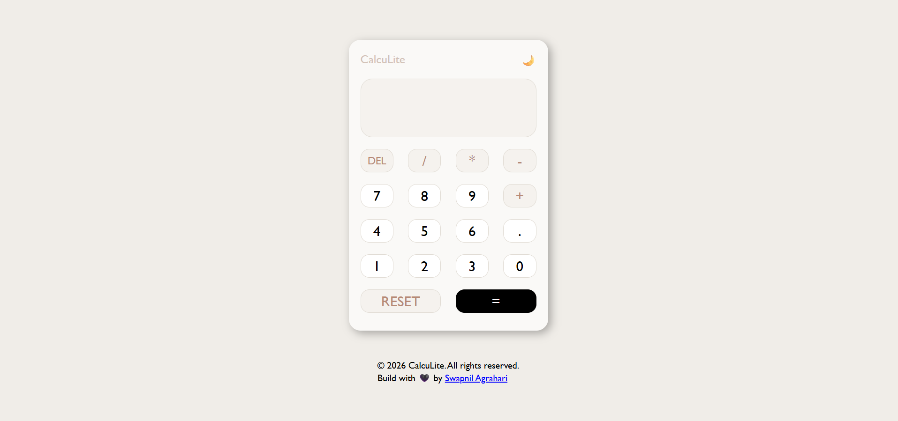
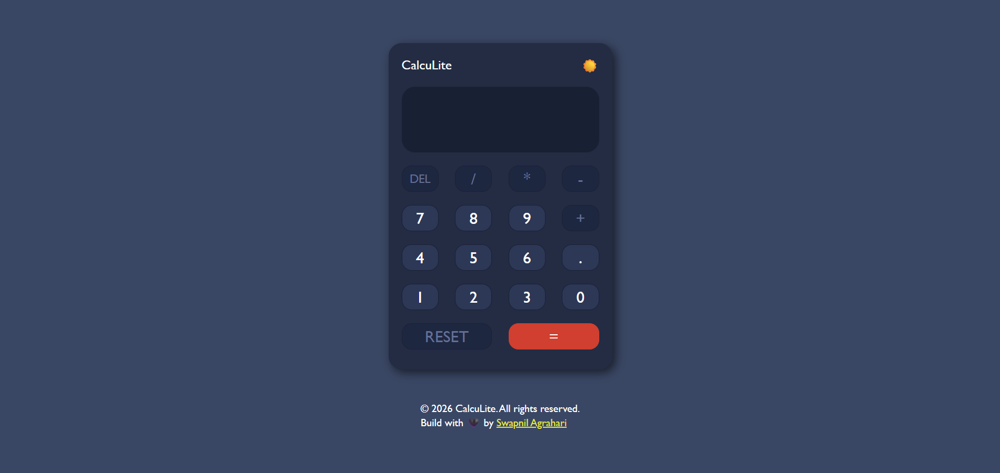

# CalcuLite

A free, fast, and lightweight calculator app with real-time input, smooth light/dark theme toggle, and zero dependencies.

---

## 🔗 Links

- **Live Site:** [https://ag-swapnil1.github.io/calculite](https://ag-swapnil1.github.io/calculite)
- **GitHub:** [ag-swapnil1/calculite](https://github.com/ag-swapnil1/calculite)

---

## 📸 Screenshots

**Light Mode:**


**Dark Mode:**


---

## ✨ Features

- Addition, subtraction, multiplication, and division
- DEL — removes the last entered character
- RESET — clears the entire expression
- Light / Dark theme toggle with 🌙 / ☀️
- Theme preference saved and restored via `localStorage`
- Prevents evaluation when expression ends on an operator
- Smooth animated transitions on theme switch
- Button press animation for tactile feedback
- Fully responsive — works on mobile and desktop

---

## 🛠️ Built With

- Semantic HTML5
- CSS custom properties & CSS Grid
- Vanilla JavaScript (no libraries)

---

## 📁 Project Structure

```
calculite/
├── css/
│   └── index.css
├── js/
│   └── index.js
├── assets/
│   └── fevicon.svg
├── docs/
|   ├── desktop-preview.png
│   ├── mobile-preview.png
│   └── dark-preview.png
├── .gitignore
├── LICENSE
├── README.md
└── index.html
```

---

## 🚀 Getting Started

```bash
git clone https://github.com/ag-swapnil1/calculite.git
cd calculite
open index.html
```

No build tools or dependencies required — pure HTML, CSS & JavaScript.

---

## 👤 Author

- **GitHub:** [@ag-swapnil1](https://github.com/ag-swapnil1)
- **Frontend Mentor:** [@ag-swapnil1](https://www.frontendmentor.io/profile/ag-swapnil1)

---

## 📄 License

Open source under the [MIT License](./LICENSE).
